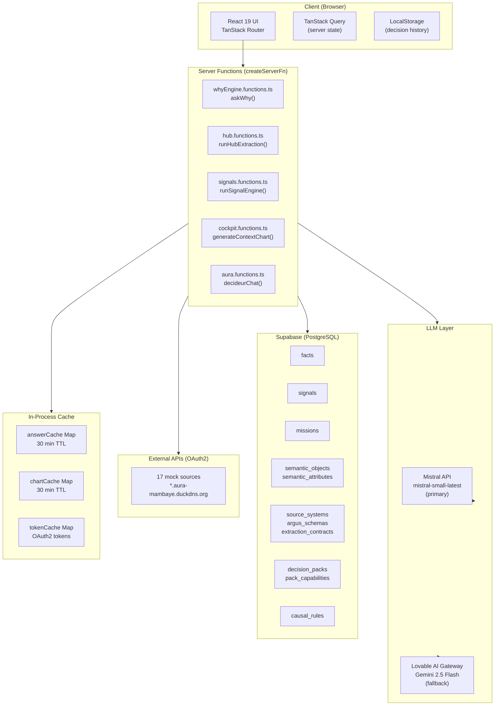
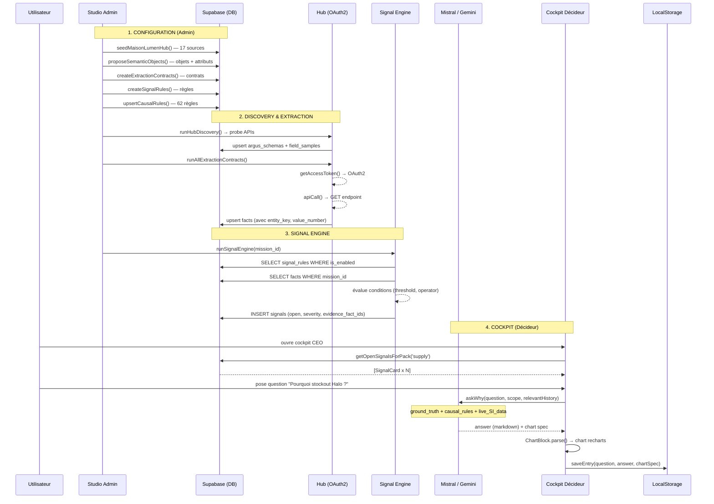

# Aura Decision-Zen — État technique complet
*Rapport de code réel. Aucun résumé marketing. Fidèle à l'état du dépôt au 2 juillet 2026.*

---

## 1. Vue d'ensemble

### Architecture globale

Aura est une application SSR full-stack construite sur **TanStack Start** (framework SSR over Vite/Nitro). Il n'y a pas de serveur Express ou FastAPI séparé — le backend est entièrement constitué de **`createServerFn`** (fonctions RPC typées appelées depuis le client comme des appels réseau normaux). Le frontend React 19 et les fonctions serveur cohabitent dans le même dépôt, bundlés par Vite, déployés sur Nitro (cible Cloudflare Workers).

La **base de données** est Supabase (PostgreSQL managé). L'**authentification** est Supabase Auth (email/password). L'**IA** utilise Mistral en primaire et Gemini 2.5 Flash (via gateway Lovable) en fallback. Les **données opérationnelles** proviennent de 17 sources OAuth2 hébergées sur `*.aura-mambaye.duckdns.org` (serveur mock).

### Schéma Mermaid — Architecture globale



---

## 2. Stack technique

| Couche | Technologie | Version | Notes |
|---|---|---|---|
| **Frontend** | React | 19.2.0 | |
| **SSR Framework** | TanStack Start | 1.167.50 | Vite-first SSR |
| **Router** | TanStack Router | 1.168.25 | File-based, type-safe |
| **Build** | Vite | 7.3.1 | + Nitro 3.x Cloudflare target |
| **CSS** | Tailwind CSS | 4.2.1 | CSS variables, pas de classes JIT standards |
| **UI Components** | Shadcn/Radix | — | Accordion, Dialog, Drawer, Sheet… |
| **Charts** | Recharts | 2.15.4 | Radar, Bar, Waterfall, Line |
| **Graph** | @xyflow/react | 12.11.0 | React Flow — ontologie, lineage, raisonnement |
| **BDD** | Supabase (PostgreSQL) | — | `gxqneyjkdxwbssxcdgok.supabase.co` |
| **Auth** | Supabase Auth | — | Email/password, JWT |
| **RLS** | Supabase RLS | — | Activé sur toutes les tables principales |
| **ORM** | Aucun | — | Requêtes Supabase SDK directes |
| **State management** | TanStack Query | 5.83.0 | Server state uniquement |
| **State local** | React `useState` | — | Pas de Zustand/Redux |
| **LLM primaire** | Mistral | mistral-small-latest | Via `api.mistral.ai` |
| **LLM fallback** | Gemini 2.5 Flash | — | Via `ai.gateway.lovable.dev` |
| **Cache LLM** | `Map` in-process | — | 30 min TTL, non persistant |
| **Email** | Resend | — | API key vide en `.env` |
| **PDF/PPTX** | pdf-lib 1.17.1 + pptxgenjs 4.0.1 | — | Export côté client |
| **Markdown** | Composant interne `Markdown.tsx` | — | react-markdown dans package.json mais absent de node_modules |
| **MCP** | Aucun | — | Pas de config MCP dans le projet |
| **Vector DB** | Aucun | — | Pas de RAG, pas d'embeddings |
| **API externe** | 17 sources OAuth2 | — | `*.aura-mambaye.duckdns.org` (mock) |
| **Déploiement** | Cloudflare Workers | — | Via Nitro preset |
| **Package manager** | Bun | — | |
| **TypeScript** | 5.8.3 | — | strict mode |

---

## 3. Arborescence complète

```
aura-decision-zen/
├── src/
│   ├── assets/
│   │   └── aura-logo.png.asset.json          # Manifest asset logo
│   │
│   ├── components/
│   │   ├── admin/
│   │   │   ├── CopilotPanel.tsx              # Panel chat IA (Mistral) flottant admin
│   │   │   ├── CopilotProvider.tsx           # Context React open/close copilot
│   │   │   ├── CRDecisionsSchema.tsx         # Affichage schéma DB statique
│   │   │   ├── DecisionLineage.tsx           # React Flow : lineage signal→fact→source
│   │   │   ├── FactGraphFlow.tsx             # React Flow : graphe des facts
│   │   │   ├── OntologyGraph.tsx             # React Flow : objets sémantiques
│   │   │   ├── PipelineBanner.tsx            # Statut pipeline (barre progression)
│   │   │   └── VendorLogo.tsx               # Rendu logos fournisseurs
│   │   │
│   │   ├── aura/
│   │   │   ├── AskAuraFab.tsx               # FAB "Pourquoi ?" (cockpit décideur)
│   │   │   ├── AskAuraStudioFab.tsx          # FAB variante Studio
│   │   │   ├── ChartBlock.tsx               # Parse et rend les blocs ```chart LLM
│   │   │   ├── DecisionHistoryPanel.tsx      # Drawer historique décisions (localStorage)
│   │   │   ├── Markdown.tsx                 # Renderer markdown interne (no deps)
│   │   │   ├── PersonaSwitcher.tsx          # Tabs CEO/CFO/CIO/COO
│   │   │   ├── ReasoningGraph.tsx           # React Flow : chaîne de raisonnement LLM
│   │   │   ├── Shell.tsx                    # Layout shell cockpit (breadcrumbs, header)
│   │   │   └── emailTemplate.ts             # Builder HTML email pour Resend
│   │   │
│   │   ├── decideur/
│   │   │   ├── CapCharts.tsx               # Radar/bar recharts par capability
│   │   │   ├── ExternalContextPanel.tsx     # Sidebar flux externes (marché/news)
│   │   │   ├── MarketWidget.tsx             # Widget données marché
│   │   │   ├── ScenarioAnalyzer.tsx         # Formulaire + résultats What-If
│   │   │   │
│   │   │   ├── cockpit/
│   │   │   │   ├── AskAuraPanel.tsx         # Chat inline cockpit (appelle askWhy)
│   │   │   │   ├── CapScoreBadge.tsx        # Badge score CAP coloré
│   │   │   │   ├── ConfidenceBadge.tsx      # Badge confiance %
│   │   │   │   ├── ContributorBar.tsx       # Barre empilée contributeurs
│   │   │   │   ├── DecideurCockpitView.tsx  # Layout cockpit principal par persona
│   │   │   │   ├── DecisionCard.tsx         # Carte décision
│   │   │   │   ├── EvidenceDrawer.tsx       # Drawer preuves facts d'un signal
│   │   │   │   ├── PersonaCockpit.tsx       # Wrapper par persona
│   │   │   │   ├── RecommendationCard.tsx   # Carte recommandation
│   │   │   │   └── SignalCard.tsx           # Carte signal/alerte
│   │   │   │
│   │   │   └── viz/
│   │   │       ├── ConfidenceMeter.tsx      # Gauge de confiance
│   │   │       ├── Quadrant.tsx             # Quadrant 2×2 (recharts)
│   │   │       ├── RadarOptions.tsx         # Radar scoring options
│   │   │       ├── ScenarioComparator.tsx   # Comparaison scénarios côte à côte
│   │   │       ├── SignalTree.tsx           # Arbre signal → sous-signaux
│   │   │       ├── Waterfall.tsx            # Waterfall P&L/cash (recharts)
│   │   │       └── index.ts                # Re-export tous les viz
│   │   │
│   │   ├── ui/                             # ~40 composants Shadcn/Radix
│   │   │   └── [accordion, alert-dialog, avatar, badge, button, calendar,
│   │   │       card, carousel, chart, checkbox, command, dialog, drawer,
│   │   │       dropdown-menu, form, input, label, pagination, popover,
│   │   │       progress, radio-group, scroll-area, select, separator,
│   │   │       sheet, sidebar, skeleton, slider, sonner, switch, table,
│   │   │       tabs, textarea, toggle, tooltip, ...]
│   │   │
│   │   └── why/
│   │       └── WhyConsole.tsx              # Console chat plein écran "Pourquoi ?"
│   │
│   ├── data/
│   │   ├── discoveryMock.ts               # 3 sessions Discovery statiques (Maison Lumen)
│   │   └── enterpriseMock.ts              # Enterprise Map : 7 domaines L1-L4,
│   │                                      # 16 objets métier, 13 apps
│   │
│   ├── hooks/
│   │   └── use-mobile.tsx                 # useIsMobile() via matchMedia
│   │
│   ├── integrations/supabase/
│   │   ├── auth-attacher.ts              # Attache headers auth Supabase au contexte serveur
│   │   ├── auth-middleware.ts            # Middleware requireSupabaseAuth (anonyme fallback)
│   │   ├── client.server.ts              # Client Supabase admin (service role key)
│   │   ├── client.ts                     # Client Supabase navigateur (anon key)
│   │   └── types.ts                      # Types auto-générés toutes les tables
│   │
│   ├── lib/                             # Toutes les server functions + helpers serveur
│   │   ├── llm.server.ts               # Appel Gemini via gateway Lovable
│   │   ├── mistral.server.ts           # Appel Mistral API
│   │   ├── whyEngine.functions.ts      # askWhy() — moteur principal LLM décision
│   │   ├── cockpit.functions.ts        # generateContextChart(), createProjectWithInference()
│   │   ├── hub.functions.ts            # 17 sources OAuth2, extraction, seeders
│   │   ├── aura.functions.ts           # Auth, missions, packs, decideurChat()
│   │   ├── signals.functions.ts        # runSignalEngine(), facts, lineage
│   │   ├── decision.functions.ts       # Connectors, décision map, coverage
│   │   ├── action-plan.functions.ts    # CRUD plan d'action
│   │   ├── admin.functions.ts          # Utilitaires admin
│   │   ├── argus-external.functions.ts # Probes externes (APIs marché)
│   │   ├── argus-mapping.functions.ts  # Suggestions mappings par IA
│   │   ├── argus-refresh.functions.ts  # Rafraîchissement Argus planifié
│   │   ├── argus-validation.functions.ts  # Validation des mappings
│   │   ├── bridge.functions.ts         # Couche de transition ancien→nouveau modèle
│   │   ├── causal-graph.functions.ts   # CRUD règles causales
│   │   ├── comex.functions.ts          # Fonctions COMEX
│   │   ├── copilot.functions.ts        # Copilot admin (Mistral par page)
│   │   ├── decisions-crud.functions.ts # CRUD décisions étendu
│   │   ├── discovery.functions.ts      # Gestion sessions Discovery
│   │   ├── email.functions.ts          # Envoi email via Resend
│   │   ├── exports.functions.ts        # Export PDF/PPTX
│   │   ├── interviews.functions.ts     # Gestion interviews
│   │   ├── market.functions.ts         # Données marché externes + buildMarketContext()
│   │   ├── ontology-graph.functions.ts # Graphe ontologie
│   │   ├── ontology-live.functions.ts  # Mises à jour ontologie live
│   │   ├── outcomes.functions.ts       # Suivi résultats
│   │   ├── packs-admin.functions.ts    # Admin packs
│   │   ├── packs-library.functions.ts  # Bibliothèque packs
│   │   ├── pipeline.functions.ts       # Orchestration pipeline
│   │   ├── projections.functions.ts    # Projections financières
│   │   ├── projects.functions.ts       # CRUD projets
│   │   ├── readiness-score.functions.ts   # Calcul score readiness
│   │   ├── readiness.functions.ts      # Assessment readiness
│   │   ├── scenarios.functions.ts      # Gestion scénarios
│   │   ├── scenarios-whatif.functions.ts  # What-if scenarios
│   │   ├── semantic.functions.ts       # CRUD objets/attributs sémantiques
│   │   ├── templates.functions.ts      # Templates décision
│   │   └── templates-library.functions.ts
│   │
│   ├── routes/
│   │   ├── __root.tsx                 # Root layout : QueryClient + Router
│   │   ├── index.tsx                  # / — Landing / redirect
│   │   ├── auth.tsx                   # /auth — Formulaire Supabase Auth
│   │   ├── report.$token.tsx          # /report/:token — Rapport public tokenisé
│   │   ├── app.tsx                    # /app — AppShell layout
│   │   ├── app.*.tsx                  # ~35 routes sous /app
│   │   ├── cockpit.tsx                # /cockpit — Layout cockpit standalone
│   │   ├── cockpit.*.tsx              # ~8 routes sous /cockpit
│   │   ├── studio.tsx                 # /studio — Layout Studio Admin
│   │   └── studio.*.tsx              # ~17 routes sous /studio
│   │
│   ├── router.tsx                     # createRouter + QueryClient context
│   └── server.ts                      # Point d'entrée serveur Nitro
│
├── supabase/
│   ├── config.toml                   # Config Supabase local dev
│   └── migrations/                   # 60+ fichiers SQL migration
│
├── public/                           # Assets statiques
├── .env                              # Supabase URL/keys (MISTRAL_API_KEY absent)
├── package.json
├── vite.config.ts                    # Délègue à @lovable.dev/vite-tanstack-config
├── tsconfig.json
└── bun.lockb
```

---

## 4. Modèle de données

### `profiles`
| Colonne | Type | Contrainte |
|---|---|---|
| id | UUID PK | → auth.users |
| email | TEXT | |
| full_name | TEXT | |
| org_name | TEXT | |
| created_at | TIMESTAMPTZ | |

*Usage :* créé automatiquement par trigger `on_auth_user_created`. Premier utilisateur → rôle `admin` auto.

---

### `user_roles`
| Colonne | Type | Contrainte |
|---|---|---|
| id | UUID PK | |
| user_id | UUID | → auth.users |
| role | app_role ENUM | `'admin'` \| `'decideur'` |

*Contrainte :* UNIQUE(user_id, role). Fonction `has_role(user_id, role) → boolean`.

---

### `decision_packs`
| Colonne | Type | Contrainte |
|---|---|---|
| id | UUID PK | |
| slug | TEXT | UNIQUE |
| title | TEXT | |
| description | TEXT | |
| category | TEXT | |
| icon | TEXT | DEFAULT 'compass' |
| is_published | BOOLEAN | DEFAULT true |
| created_at | TIMESTAMPTZ | |

*Données :* 6 packs seedés (ia-strategy, ia-readiness, build-vs-buy, vendor-selection, roi-business-case, risk-compliance).

---

### `missions`
| Colonne | Type | Contrainte |
|---|---|---|
| id | UUID PK | |
| owner_id | UUID | → auth.users |
| org_id | UUID | → organizations |
| client_name | TEXT | |
| sector | TEXT | |
| status | TEXT | DEFAULT 'cadrage' |
| context | TEXT | |
| created_at | TIMESTAMPTZ | |
| updated_at | TIMESTAMPTZ | |

*Usage :* contexte de toutes les données (facts, signals, sources sont scoped par mission_id). Mission Maison Lumen = `11111111-1111-1111-1111-111111111111`.

---

### `facts`
| Colonne | Type | Contrainte |
|---|---|---|
| id | UUID PK | |
| mission_id | UUID | → missions |
| object_id | UUID | → semantic_objects |
| object_name | TEXT | |
| object_type | TEXT | GENERATED STORED |
| attribute_id | UUID | → semantic_attributes |
| attribute_name | TEXT | |
| entity_key | TEXT | Clé métier (ex: SKU id) |
| value_number | NUMERIC | |
| value_text | TEXT | |
| value_jsonb | JSONB | |
| unit | TEXT | |
| source_app | TEXT | |
| source_system_id | UUID | → source_systems |
| source_endpoint | TEXT | |
| raw_payload | JSONB | |
| extraction_contract_id | UUID | → extraction_contracts |
| observed_at | TIMESTAMPTZ | |
| stale_at | TIMESTAMPTZ | |
| confidence | FLOAT | |

*Index :* (mission_id, object_name, entity_key), (mission_id, attribute_name).

---

### `signals`
| Colonne | Type | Contrainte |
|---|---|---|
| id | UUID PK | |
| mission_id | UUID | → missions |
| pack_id | UUID | → decision_packs |
| decision_contract_id | UUID | |
| rule_id | UUID | |
| rule_key | TEXT | |
| title | TEXT | |
| signal_type | TEXT | |
| entity_key | TEXT | |
| cause | TEXT | |
| severity | TEXT | |
| confidence | FLOAT | |
| suggested_action | TEXT | |
| status | TEXT | |
| evidence_fact_ids | UUID[] | |
| evaluated_at | TIMESTAMPTZ | |
| payload | JSONB | |
| created_at | TIMESTAMPTZ | |

---

### `signal_rules`
| Colonne | Type | Notes |
|---|---|---|
| id | UUID PK | |
| rule_key | TEXT UNIQUE | |
| signal_type | TEXT | |
| pack_slug | TEXT | |
| title | TEXT | |
| severity_default | TEXT | |
| is_enabled | BOOLEAN | |
| config | JSONB | Seuils et paramètres |
| contributors | JSONB | |

---

### `source_systems`
| Colonne | Type | Notes |
|---|---|---|
| id | UUID PK | |
| mission_id | UUID | → missions |
| slug | TEXT | UNIQUE par mission |
| name, vendor, sector | TEXT | |
| base_url | TEXT | Ex: `https://nexerp.aura-mambaye.duckdns.org` |
| token_url | TEXT | Endpoint OAuth2 token |
| client_id, client_secret | TEXT | **Hardcodés en clair** |
| system_type, access_method, trust_tier | TEXT | |
| last_discovery_at, last_extraction_at | TIMESTAMPTZ | |

---

### `argus_schemas`
| Colonne | Type | Notes |
|---|---|---|
| id | UUID PK | |
| source_system_id | UUID | → source_systems |
| endpoint_path, http_method | TEXT | |
| entity_label, summary | TEXT | |
| sample_record | JSONB | |
| discovered_at | TIMESTAMPTZ | |

UNIQUE(source_system_id, endpoint_path).

---

### `extraction_contracts`
| Colonne | Type | Notes |
|---|---|---|
| id | UUID PK | |
| decision_contract_id | UUID | |
| object_id | UUID | → semantic_objects |
| attribute_id | UUID | → semantic_attributes |
| source_system | TEXT | |
| source_field | TEXT | |
| target_attribute_path | TEXT | |
| refresh_interval_minutes | INT | |
| mapping_confidence | FLOAT | |
| status | TEXT | |
| last_run_at | TIMESTAMPTZ | |
| last_value_sample | JSONB | |

---

### `causal_rules`
| Colonne | Type | Notes |
|---|---|---|
| id | UUID PK | |
| code | TEXT UNIQUE | R01…R62 |
| title, rationale | TEXT | |
| domain, cause_object, cause_attribute | TEXT | |
| operator | TEXT | `>`, `<`, `=` |
| threshold | TEXT | |
| effect_object, effect_attribute, direction | TEXT | |
| confidence | FLOAT | |
| is_active | BOOLEAN | DEFAULT true |

*62 règles couvrant 12 CAPs (CAP-01 Supplier Risk → CAP-12 HR & Workforce).*

---

### `organizations`
| Colonne | Type | Notes |
|---|---|---|
| id | UUID PK | |
| name, slug | TEXT | UNIQUE slug |
| plan | TEXT | DEFAULT 'starter' |
| max_missions, max_users | INT | |
| ai_calls_used, ai_calls_limit | INT | |

---

### Autres tables
`semantic_objects`, `semantic_attributes`, `decision_contracts`, `pack_capabilities`, `decision_recommendations`, `recommendation_effects`, `decisions`, `decision_scenarios`, `projects`, `project_capability_impacts`, `connectors_catalog`, `interviews`, `action_plan`, `outcomes`, `report_shares`, `argus_external_probes`, `argus_applications`, `argus_field_samples`, `usage_events`, `organization_members`.

---

## 5. Pages existantes

### Espace `/app` (workspace décideur)

| URL | Objectif | Services | Statut |
|---|---|---|---|
| `/app/` | Sélecteur d'espace | `getMyRoles` | ✅ Implémenté |
| `/app/ops` | Terrain (Why? console) | `askWhy` | ✅ Implémenté |
| `/app/manager` | Cockpit manager tactique | — | ⚠️ Partiel |
| `/app/direction` | Pilotage direction | — | ⚠️ Partiel |
| `/app/comex` | Cockpit exécutif COMEX | `comex.functions` | ⚠️ Partiel |
| `/app/rh` | Espace RH | — | ⚠️ Partiel |
| `/app/decideur/` | Vue globale signals | `getOpenSignalsForPack` | ✅ |
| `/app/decideur/cockpit` | Sélecteur persona | — | ✅ |
| `/app/decideur/cockpit/ceo` | Cockpit CEO | `getOpenSignalsForPack`, `generateContextChart` | ✅ |
| `/app/decideur/cockpit/cfo` | Cockpit CFO | idem | ✅ |
| `/app/decideur/cockpit/cio` | Cockpit CIO | idem | ✅ |
| `/app/decideur/cockpit/coo` | Cockpit COO | idem | ✅ |
| `/app/decideur/signals` | Liste signaux | `getSignalsWithEvidence` | ✅ |
| `/app/decideur/recommendations` | Recommandations | `getDecisionSupport` | ✅ |
| `/app/decideur/scenarios` | What-if | `listScenarios` | ⚠️ Partiel |
| `/app/decideur/action-plan` | Plan d'action | `getActionPlan` | ⚠️ Partiel |
| `/app/decideur/library` | Bibliothèque packs | `listPacksLibrary` | ✅ |
| `/app/decideur/packs` | Activation packs | `listPacks`, `togglePack` | ✅ |
| `/app/decideur/projections` | Projections financières | `getProjections` | 🔴 Mock |
| `/app/decideur/outcomes` | Suivi résultats | `listOutcomes` | 🔴 Mock |
| `/app/conseil/` | Dashboard consultant | — | ⚠️ Partiel |
| `/app/conseil/architecture` | Landscape SI | `enterpriseMock` | 🔴 Mock |
| `/app/conseil/capabilities` | Capabilities | — | ⚠️ Partiel |
| `/app/admin/hub` | Argus Hub | `getHubStatus`, `seedMaisonLumenHub`, `runHubExtraction`… | ✅ Central |
| `/app/admin/signals` | Moteur signaux | `runSignalEngine`, `getSignalsWithEvidence` | ✅ |
| `/app/admin/facts` | Graphe facts | `getFactGraph` | ✅ |
| `/app/admin/semantic` | Contrats sémantiques | `semantic.functions` | ✅ |
| `/app/admin/causal-graph` | Règles causales | `causal-graph.functions` | ✅ |
| `/app/admin/missions` | Missions | `listMissions`, `getMission` | ✅ |
| `/app/admin/pipeline` | Pipeline complet | `pipeline.functions` | ✅ |
| `/app/admin/decision-lineage` | Lineage signal→source | `getDecisionLineage` | ✅ |
| `/app/admin/projects` | Portfolio projets | `listProjects`, `createProjectWithInference` | ✅ |

### Espace `/cockpit` (standalone)

| URL | Objectif | Services | Statut |
|---|---|---|---|
| `/cockpit/ask` | Chat "Pourquoi ?" | `askWhy` | ✅ + historique localStorage |
| `/cockpit/decisions` | Décisions utilisateur | `listMyDecisions` | ✅ |
| `/cockpit/history` | Historique décisions | localStorage | ✅ |
| `/cockpit/signals` | Signaux | — | ⚠️ Partiel |
| `/cockpit/bookmarks` | Favoris | — | ⚠️ Partiel |

### Espace `/studio` (Studio Admin)

| URL | Objectif | Services | Statut |
|---|---|---|---|
| `/studio/enterprise` | Enterprise Map | `enterpriseMock` | 🔴 Mock |
| `/studio/library` | Bibliothèque décisions | — | ⚠️ Partiel |
| `/studio/discovery` | Sessions Discovery | `discoveryMock` | 🔴 Mock |
| `/studio/discovery/:id` | Détail session | `discoveryMock` | 🔴 Mock |
| `/studio/semantic` | Contracts sémantiques | `semantic.functions` | ✅ |
| `/studio/extractions` | Extraction contracts | — | ⚠️ Partiel |
| `/studio/argus` | Argus V1 | — | ⚠️ Partiel |
| `/studio/argus2` | Argus V2 | — | 🔴 Mock statique |
| `/studio/signals` | Signaux | — | ⚠️ Partiel |
| `/studio/models` | Modèles décision | — | 🔴 Mock |
| `/studio/facts` | Browser facts | — | ⚠️ Partiel |
| `/studio/connectors` | Sources & Connecteurs | `listConnectors` | ✅ partiellement |
| `/studio/readiness` | Readiness décisions | — | 🔴 Mock |
| `/studio/governance` | Gouvernance données | — | 🔴 Mock |
| `/studio/settings` | Paramètres | — | ⚠️ Partiel |

---

## 6. Composants — Résumé responsabilités

| Composant | Responsabilité | Props clés | Réutilisation |
|---|---|---|---|
| `WhyConsole` | Chat "Pourquoi ?" plein écran; gère l'historique de messages, appelle `askWhy`, extrait les specs de chart du markdown | `scope`, `initialQuestion`, `decisionContext` | `/app/ops`, `AskAuraFab` |
| `AskAuraFab` | FAB flottant ouvrant `WhyConsole` en drawer | `scope`, `decisionContext` | Toutes pages cockpit |
| `ChartBlock` | Parse `{type, title, data}` et rend le bon chart recharts | `spec: ChartSpec` | `WhyConsole`, `cockpit.ask` |
| `Markdown` | Renderer markdown léger sans deps (headers, bold, lists, code, blockquotes) | `children: string` | Partout où LLM répond |
| `DecisionHistoryPanel` | Drawer historique localStorage, groupé par date, pin/delete/replay | `open`, `onClose`, `onReplay?` | `/cockpit/ask` |
| `Shell` (aura) | Layout page avec breadcrumbs et header | `children`, `title?` | Routes cockpit |
| `AuraShell` | Layout complet avec sidebar nav, brand, items | `brand`, `tagline`, `items`, `hideAskSidebar?` | Studio, App |
| `DecideurCockpitView` | Layout principal cockpit par persona: signals + recommandations + graphiques | `persona` | Cockpits CEO/CFO/CIO/COO |
| `SignalCard` | Carte signal avec badge sévérité, lien preuve | `signal`, `onClick?` | Partout signaux |
| `EvidenceDrawer` | Drawer avec facts prouvant un signal | `signal`, `open`, `onClose` | Cockpit |
| `FactGraphFlow` | React Flow graphe facts → objets sémantiques | aucune | `/app/admin/facts` |
| `DecisionLineage` | React Flow signal → fact → source → pack | `signalIds: string[]` | `/app/admin/decision-lineage` |
| `CopilotPanel` | Chat Mistral contextuel par page admin | aucune (context) | Toutes pages admin |

---

## 7. Services (server functions)

### `askWhy` (`whyEngine.functions.ts`)
- **Responsabilité** : Répond à une question décision en contexte Maison Lumen
- **Input** : question, scope, history, decisionContext, relevantHistory
- **Logique** : cache 30 min → fetchSILiveData() + fetchExternalFeeds() → prompt avec ground truth + 62 règles causales → Mistral (primaire) ou Gemini (fallback)
- **État** : `answerCache: Map<string, {answer, model, exp}>` in-process

### `runSignalEngine` (`signals.functions.ts`)
- **Responsabilité** : Évalue toutes les `signal_rules` sur les `facts` actuels; insert les signaux déclenchés
- **Input** : `mission_id?`
- **Logique** : Lit rules + facts → évalue conditions config-based → upsert signals → log dans `signal_engine_runs`
- **État** : aucun côté serveur (idempotent)

### `runAllExtractionContracts` (`hub.functions.ts`)
- **Responsabilité** : Exécute tous les contrats d'extraction actifs pour une mission
- **Input** : `mission_id?`
- **Logique** : Lit `extraction_contracts` → `getAccessToken()` → API call → résolution valeur par dot-path → upsert `facts`
- **État** : `tokenCache: Map` in-process (tokens OAuth2)

### `generateContextChart` (`cockpit.functions.ts`)
- **Responsabilité** : Génère une spec de chart contextuelle pour le cockpit
- **Input** : `pack_slug`, `question`, `lastAnswer?`
- **Logique** : Regex pattern detection sur la question → fetch signals + facts → Mistral → JSON spec
- **État** : `chartCache: Map<string, {chart, pattern, exp}>` in-process 30 min

### `decideurChat` (`aura.functions.ts`)
- **Responsabilité** : Chat décision par pack avec ACL confidentialité (`public`/`restricted`/`comex`/`rh_only`)
- **Input** : `pack_slug`, `question`, `history?`, `external_data?`
- **Logique** : Vérifie rôle utilisateur vs confidentialité du pack → fetch causal rules + facts + signals → Mistral premier + Gemini fallback

---

## 8. Modèles métier réels

| Objet | Stockage | État |
|---|---|---|
| **Decision Pack** | `decision_packs` (DB) | ✅ Réel, 6 packs seedés |
| **Mission** | `missions` (DB) | ✅ Réel |
| **Fact** | `facts` (DB) | ✅ Réel, alimenté via extraction |
| **Signal** | `signals` (DB) | ✅ Réel, généré par `runSignalEngine` |
| **Signal Rule** | `signal_rules` (DB) | ✅ Réel, config JSONB |
| **Causal Rule** | `causal_rules` (DB) | ✅ 62 règles, texte dans whyEngine + DB |
| **Source System** | `source_systems` (DB) | ✅ Réel, 17 sources Maison Lumen |
| **Argus Schema** | `argus_schemas` (DB) | ✅ Réel (après discovery) |
| **Extraction Contract** | `extraction_contracts` (DB) | ✅ Réel |
| **Semantic Object** | `semantic_objects` (DB) | ✅ Réel |
| **Semantic Attribute** | `semantic_attributes` (DB) | ✅ Réel |
| **Decision Contract** | `decision_contracts` (DB) | ✅ Réel |
| **Recommendation** | `decision_recommendations` (DB) | ✅ Réel |
| **Organization** | `organizations` (DB) | ✅ Réel |
| **User Role** | `user_roles` (DB) | ✅ Réel |
| **Decision** (conversation) | `decisions` (DB) | ✅ Réel |
| **Report Share** | `report_shares` (DB) | ✅ Réel (token public) |
| **Connector** | `connectors_catalog` (DB) | ✅ Réel |
| **Project** | `projects` (DB) | ✅ Réel |
| **Business Capability** (Enterprise Map) | `enterpriseMock.ts` (mock) | 🔴 Statique uniquement |
| **Business Object** (Enterprise Map) | `enterpriseMock.ts` (mock) | 🔴 Statique uniquement |
| **Discovery Session** | `discoveryMock.ts` (mock) | 🔴 Statique uniquement |

---

## 9. Fonctionnalités

### ✅ Implémentées et fonctionnelles

- Auth Supabase email/password + RLS
- Gestion missions multi-clients
- Pipeline d'extraction : seeding 17 sources → OAuth2 → discovery → facts → signaux
- Moteur de signaux : évaluation rules sur facts, insertion DB
- Cockpit décideur (4 personas CEO/CFO/CIO/COO) avec signaux, recommandations, graphiques
- Chat "Pourquoi ?" (askWhy) : contexte ground truth + règles causales + données live
- Historique décisions en localStorage avec replay
- Graphes React Flow : ontologie, lineage, reasoning chain
- Export rapport PDF/PPTX (pdf-lib + pptxgenjs)
- Rapport public tokenisé (sans auth)
- Multi-tenancy organisations + quotas (table `organizations`)
- Admin pipeline complet (hub, argus, extraction, signal engine)

### ⚠️ Partielles (UI présente, logique incomplète)

- Cockpits manager, direction, comex, RH (layout sans données réelles)
- Scénarios what-if (form + UI, calcul backend limité)
- Plan d'action (table DB, UI basique)
- Suivi outcomes (table DB, UI basique)
- Projections financières (UI sans modèle réel)
- Governance dashboard (/studio/governance)
- Sources & Connectors (/studio/connectors) : UI riche, catalogue statique + quelques appels DB

### 🔴 Mock (données statiques hardcodées)

- Enterprise Map (`enterpriseMock.ts`) : hiérarchie L1-L4, 16 objets, 13 apps — aucune donnée DB
- Decision Discovery (`discoveryMock.ts`) : 3 sessions statiques
- Argus V2 (`studio.argus2.tsx`) : tous les KPIs sont des constantes TS
- Studio Readiness : 6 capabilities hardcodées dans le composant
- Studio Models : données statiques

### 🔲 À faire

- Vraie persistance Enterprise Map en base
- Decision Discovery : backend réel (interviews, génération assets)
- `RESEND_API_KEY` vide → emails non fonctionnels
- Argus V2 connecté à de vraies données
- RAG / embeddings (aucun actuellement)
- Pagination sur toutes les listes
- Tests automatisés (zéro test dans le projet)

---

## 10. IA — Description précise

### LLMs utilisés

| Modèle | Provider | Endpoint | Usage |
|---|---|---|---|
| `mistral-small-latest` | Mistral AI | `api.mistral.ai/v1/chat/completions` | Primary : askWhy, decideurChat, generateContextChart, inferCapabilities, draftSection |
| `google/gemini-2.5-flash` | Lovable AI Gateway | `ai.gateway.lovable.dev/v1/chat/completions` | Fallback systématique si Mistral échoue |

### Prompts

**`askWhy` — system prompt (synthèse) :**
```
Tu es Aura, assistant IA de décision d'entreprise expert Maison Lumen.
[MAISON_LUMEN_GROUND_TRUTH]
- Fournisseurs : 5 fournisseurs, OTIF, lead times, scores financiers
- Trésorerie : 1,24M€ solde, -340k€ J+30
- Boutiques : 6 boutiques, CA, conversion, panier moyen
- Stocks : 6,2j couverture, Manhattan WMS
- Marges : 47,2%
- CRM : 2 847 VIP, NPS 67
[VALIDATED_MAPPINGS] (12 mappings Argus)
[CAUSAL_RULES] (62 règles R01-R62, CAP-01 à CAP-12)
[LIVE_SI_DATA] (fetchSILiveData() — données OAuth2 temps réel)
[EXTERNAL_FEEDS] (fetchExternalFeeds() — marchés, news)
[RELEVANT_HISTORY] (findRelevant() localStorage — top 4 questions similaires)
[CONVERSATION_HISTORY]
Réponds en français, structuré, cite les faits.
```

**Temperature : `0`** (déterminisme, pas de créativité).

### Cache

- `answerCache` : `Map<string, {answer, model, exp}>` — clé `scope|decisionId|question.toLowerCase()` — TTL 30 min — **en mémoire uniquement, perdu au redémarrage**
- `chartCache` : idem pour les specs de chart
- `tokenCache` OAuth2 : durée = expiry du token - 60s

### RAG / Embeddings

**Aucun.** Pas de vector database, pas d'embeddings. Le "contexte" est injecté manuellement dans le prompt système (ground truth hardcodé + données live + règles causales textuelles).

### MCP

**Aucun** dans le projet applicatif.

### Agents / Outils

Pas d'agents au sens LLM (pas de tool_use, pas de function calling). Les LLMs reçoivent un prompt et renvoient du texte libre. L'extraction de la spec de chart se fait par **parsing regex du texte Markdown** côté client (`ChartBlock.tsx` extrait les blocs ` ```chart `).

---

## 11. Décision — Flux précis

### Comment une Decision Capability est stockée

Il n'existe **pas de table `decision_capabilities`**. Les capabilities sont :
1. En DB : `pack_capabilities` (lien pack → capability textuelle) — peu utilisée
2. Dans `causal_rules.code` : préfixe `CAP-01` à `CAP-12` — texte uniquement
3. Dans `whyEngine.functions.ts` : `CAUSAL_RULES` array hardcodé dans le code TS — **non synchronisé avec la DB**
4. Dans `enterpriseMock.ts` : hiérarchie L1-L4 — mock statique

### Comment un Signal est calculé

```
signal_rules (DB) ← config JSONB { threshold, attribute, operator }
        ↓
runSignalEngine() lit facts (DB) filtrés par mission_id
        ↓
Pour chaque rule active : évalue condition (value_number > threshold)
        ↓
Si vrai → INSERT signals (DB) avec evidence_fact_ids, severity, title
        ↓
signal_engine_runs log → DB
```

### Comment les données sont récupérées

```
source_systems (DB) ← slug, base_url, client_id, client_secret, token_url
        ↓
getAccessToken(src) → POST /oauth/token → Bearer token (cache in-process)
        ↓
apiCall(src, endpoint) → GET {base_url}{endpoint} + Authorization: Bearer
        ↓
runAllExtractionContracts() :
  extraction_contracts (DB) → résolution endpoint via resolveEndpoint()
  → extraire valeur par dot-path
  → UPSERT facts (DB)
```

### Comment le cockpit est alimenté

```
getOpenSignalsForPack(pack_slug) → SELECT signals WHERE status='open' ORDER BY severity
getSignalsWithEvidence() → signals + signal_rules + engine_runs + packs
getDecisionSupport() → signals + recommendations + external probes
askWhy(question) → cache ou LLM → texte markdown + éventuelle spec chart
generateContextChart(question) → cache ou LLM → {type, title, data}
```

---

## 12. Flux d'exécution



---

## 13. Dette technique

### Code dupliqué
- `MAISON_LUMEN_GROUND_TRUTH` et `CAUSAL_RULES` existent **en double** : dans `whyEngine.functions.ts` (hardcodé) **et** (partiellement) dans la DB (`causal_rules`, `facts`). Aucune synchronisation.
- Logique de retry LLM (Mistral → Gemini) dupliquée dans `whyEngine.functions.ts`, `aura.functions.ts` (`decideurChat`), `cockpit.functions.ts` — pas de helper partagé.
- Pattern de requête Supabase "fetch signals + facts + packs" répété dans au moins 5 fonctions différentes sans abstraction.

### Magic values / TODO
- `mission_id = '11111111-1111-1111-1111-111111111111'` hardcodé dans plusieurs fonctions comme valeur par défaut.
- Credentials OAuth2 (17 paires client_id/client_secret) hardcodés dans `MAISON_LUMEN_SOURCES` dans `hub.functions.ts`.
- `RESEND_API_KEY` vide — emails non fonctionnels sans config.
- `LOVABLE_API_KEY` et `MISTRAL_API_KEY` absents du `.env` livré.

### Mocks non distingués
- `studio.argus2.tsx` : tous les KPIs (87% couverture, 1842 attributs, 142 objets) sont des constantes TS qui ne correspondent à aucune donnée DB.
- `discoveryMock.ts` / `enterpriseMock.ts` : données statiques présentées dans une UI qui ne les distingue pas visuellement des données réelles (hormis les bandeaux demo).

### Architecture fragile
- **Cache in-process** : `answerCache`, `chartCache`, `tokenCache` — trois `Map` JavaScript en mémoire process. Sur Cloudflare Workers (stateless), ces caches sont vides à chaque requête. Le TTL 30 min est illusoire en production.
- **Pas de queue** : `runHubExtraction`, `runSignalEngine`, `runAllExtractionContracts` sont des appels HTTP synchrones pouvant durer plusieurs minutes — risque de timeout en prod.
- **react-markdown dans package.json, absent de node_modules** : build échoue sans installation. Remplacé par `Markdown.tsx` interne mais `package.json` non nettoyé.
- **Pas de tests** : zéro test unitaire, zéro test d'intégration, zéro test E2E.
- **Route tree auto-générée** (`routeTree.gen.ts`) : les nouvelles routes ne s'enregistrent qu'au premier démarrage du dev server. Build CI sans dev server = erreur TypeScript.
- `bridge.functions.ts` : fichier de transition entre deux modèles de données — refactorisation en cours non terminée.

---

## 14. Sécurité

### Authentification
- Supabase Auth (JWT) — middleware `requireSupabaseAuth` dans chaque `createServerFn` sensible
- **Fallback anonyme** : `requireSupabaseAuth` autorise les requêtes sans token avec `userId = 'anonymous'` — intentionnel pour la démo, dangereux en production

### RLS
- Activé sur toutes les tables principales (`missions`, `facts`, `signals`, `source_systems`…)
- Politique : `auth.uid() = owner_id` ou `has_role(auth.uid(), 'admin')`
- Les tables de configuration (packs, connectors_catalog) sont publiques en lecture

### Secrets / API Keys
| Secret | État |
|---|---|
| `SUPABASE_URL` + anon key | Dans `.env` — anon key exposée côté client (VITE_*), normal |
| `MISTRAL_API_KEY` | **Absent du `.env`** — doit être défini manuellement |
| `LOVABLE_API_KEY` | **Absent du `.env`** — doit être défini manuellement |
| `RESEND_API_KEY` | Dans `.env` mais vide |
| OAuth2 credentials (17 sources) | Hardcodés dans `hub.functions.ts` côté serveur uniquement — non exposés client mais présents en clair dans le code source |

### Permissions / ACL
- `has_role('admin')` vérifié côté serveur pour les fonctions admin (seed, reset, pipeline)
- `decideurChat` : vérification confidentialité pack (`public`/`restricted`/`comex`/`rh_only`) vs rôle user
- Pas d'audit log des accès LLM

---

## 15. Performances

### Cache
- `answerCache` / `chartCache` : Map in-process, **inefficace sur Cloudflare Workers** (stateless)
- `tokenCache` OAuth2 : idem
- Pas de Redis, pas de cache distribué
- Côté client : localStorage pour l'historique décisions (300 entrées max)

### Pagination
- `facts` : `LIMIT 50` ou `LIMIT 500` selon la requête — pas de curseur
- `signals` : `LIMIT 20` ou `LIMIT 200` — pas de pagination infinie
- `argus_field_samples` : non paginé

### Lazy Loading
- Routes chargées en code splitting automatique par Vite (chaque route = chunk séparé)
- React Flow et Recharts ne sont pas lazy-importés — bundle initial alourdi

### Optimisations présentes
- TanStack Query : stale-while-revalidate pour les données serveur
- `temperature: 0` sur les LLMs : déterminisme + légère réduction de tokens
- `AbortController` avec timeout 45s (Gemini) et 20s (Mistral) — évite les hangs

---

## 16. Ce qui fonctionne réellement

En se basant uniquement sur le code existant, connecté à Supabase et aux APIs mock :

1. **Auth complète** : inscription, connexion, rôles admin/decideur, RLS
2. **Pipeline Maison Lumen** : seed 17 sources → discovery OAuth2 → extraction facts → signal engine → signaux en DB
3. **Cockpit décideur** 4 personas : affichage signaux depuis DB, recommandations depuis DB
4. **Chat "Pourquoi ?"** (`askWhy`) : répond avec ground truth + 62 règles causales + données live OAuth2 + historique pertinent injecté dans le prompt
5. **Historique décisions** : sauvegarde localStorage, groupement par date, replay, pin
6. **Graphe de lineage** : `getDecisionLineage()` → React Flow signal→fact→source→pack
7. **Admin pipeline** : runHubDiscovery, runAllExtractionContracts, runSignalEngine, reset — tous fonctionnels
8. **Génération de chart** par LLM : `generateContextChart()` → spec JSON → recharts
9. **Missions + rapports** : CRUD missions, sections, draftSection (LLM), share token public
10. **Export PDF** : `pdf-lib` côté client
11. **Multi-tenancy** : table `organizations` avec quotas AI calls
12. **Projets + inférence capabilities** : `createProjectWithInference()` → Mistral infère les capabilities impactées

---

## 17. Ce qui est simulé (mocks)

| Fonctionnalité | Fichier | Nature du mock |
|---|---|---|
| Enterprise Map | `enterpriseMock.ts` | 7 domaines, 16 objets, 13 apps — statique TS |
| Decision Discovery | `discoveryMock.ts` | 3 sessions, interviews, scores — statique TS |
| Argus V2 stats | `studio.argus2.tsx` | 87% couverture, 1842 attributs — constantes TS |
| Studio Readiness | `studio.readiness.tsx` | 6 capabilities, scores, blockers — constantes TS |
| Studio Models | `studio.models.tsx` | Données statiques |
| Sources & Connectors V2 | `studio.connectors.tsx` | Framework matrix, accessibility scores — statique |
| Projections financières | `app.decideur/projections` | UI sans modèle réel |
| Governance dashboard | `studio.governance.tsx` | UI statique |
| External feeds | `fetchExternalFeeds()` dans whyEngine | Données fictives hardcodées (pas de vraie API marché) |
| OAuth2 sources | `*.aura-mambaye.duckdns.org` | Serveur mock (non public) |

---

## 18. Ce qui manque — par priorité

### Priorité 1 — Bloquant pour mise en production
1. `MISTRAL_API_KEY` et `LOVABLE_API_KEY` absents du `.env` livré
2. Cache LLM distribué (Redis ou Supabase `kv`) — le cache in-process ne tient pas sur Cloudflare Workers
3. Tests automatisés (zéro actuellement)
4. `RESEND_API_KEY` → emails de confirmation non fonctionnels

### Priorité 2 — Fonctionnalités core incomplètes
5. Queue asynchrone pour l'extraction et le signal engine (éviter timeouts HTTP)
6. Synchronisation `CAUSAL_RULES` : la DB doit être la source de vérité, pas le code TS
7. Persistance Enterprise Map et Discovery en DB (pas en mock statique)
8. Pagination réelle sur facts, signals, schemas

### Priorité 3 — Qualité et maintenabilité
9. Factoriser le pattern retry LLM (Mistral → Gemini) en helper unique
10. Nettoyer `package.json` (react-markdown, remark-gfm — listés mais non installables)
11. Supprimer `bridge.functions.ts` et finaliser la migration de données
12. Documenter les environnements requis (quelles env vars, quel Supabase project)

### Priorité 4 — Fonctionnalités manquantes
13. RAG / embeddings (actuellement pas de recherche sémantique)
14. Monitoring et alertes (pas d'observabilité LLM)
15. Vraie gestion multi-tenants (isolation DB par org, quotas enforced)
16. Plan d'action et outcomes complets (tables existent, UX incomplète)

---

## 19. Vision technique

### Ce qui est solide
- **Modèle de données** : le schéma Supabase (facts, signals, semantic objects, extraction contracts, causal rules) est bien pensé et extensible. La séparation facts/signals/rules est correcte.
- **Moteur de signaux** : évaluation config-based des règles sur les facts — logique claire, extensible sans code.
- **whyEngine** : le pattern injection massive dans le prompt (ground truth + règles causales + live data) fonctionne et est simple à maintenir.
- **Architecture RPC** : `createServerFn` est une très bonne abstraction — backend typé, pas de REST à maintenir, co-location code.
- **Hiérarchie de capabilities L1-L4** dans `enterpriseMock.ts` : taxonomie réelle et sérieuse pour le retail luxe.

### Ce qui devra être refactorisé
- **Cache LLM** : réécrire avec Supabase (table `llm_cache` + TTL) ou Redis — le `Map` in-process est une dette immédiate.
- **CAUSAL_RULES dans le code TS** : déplacer dans la DB. La table `causal_rules` existe déjà — il faut que `askWhy` les lise depuis Supabase au lieu du tableau hardcodé.
- **MAISON_LUMEN_GROUND_TRUTH hardcodé** : à terme, ces KPIs doivent venir des `facts` DB en temps réel, pas d'un texte statique dans le code.
- **hub.functions.ts à 1495 lignes** : diviser en modules (seed, discovery, extraction, oauth) — trop de responsabilités dans un seul fichier.
- **Mocks → persistance** : Enterprise Map, Discovery, Readiness doivent avoir un backend DB. Les mocks actuels limitent la valeur démontrable.

### Ce qui est prêt pour la production (avec les prérequis)
- Auth + RLS Supabase
- Pipeline d'extraction OAuth2 (si les vraies sources remplacent les mocks)
- Signal engine
- Cockpit décideur (données réelles disponibles)
- Export rapport + share token
- Multi-tenancy (structure DB en place)

---

## 20. Scores

| Dimension | Score | Justification |
|---|---|---|
| **Architecture** | **7/10** | TanStack Start + Supabase est un choix moderne et cohérent. Découplage fact/signal/rule correct. Pénalisé par le cache in-process inadapté au runtime Cloudflare. |
| **Code** | **6/10** | Typage TypeScript rigoureux. Nommage cohérent. Mais hub.functions.ts (1495 lignes), duplication du pattern LLM retry x3, CAUSAL_RULES en double code+DB. |
| **Performance** | **4/10** | Cache in-process inutile sur Workers. Pas de pagination sérieuse. Appels LLM synchrones dans la requête HTTP. Extraction longue sans queue. |
| **Scalabilité** | **4/10** | Multi-tenancy en DB (organizations) mais pas enforced. Cache non distribué. Pipeline sans queue = non scalable. Supabase free tier par défaut. |
| **Lisibilité** | **7/10** | Code clair, nommage explicite, structure de dossiers logique. Pénalisé par hub.functions.ts monolithique et mocks non distingués du vrai code. |
| **Dette technique** | **5/10** | Mocks statiques passent pour du vrai, react-markdown cassé, MISTRAL_API_KEY absent, 0 test, CAUSAL_RULES dupliqués, bridge.functions.ts en transit. |
| **Sécurité** | **5/10** | RLS activé, ACL par rôle, pas de secrets client. Pénalisé par fallback anonyme dans requireSupabaseAuth, credentials OAuth2 hardcodés dans le code source, pas d'audit log LLM. |
| **Maintenabilité** | **6/10** | Structure de dossiers claire, types partagés, Zod validators. Pénalisé par ~35 fichiers `.functions.ts` sans organisation par domaine métier et absence totale de tests. |
